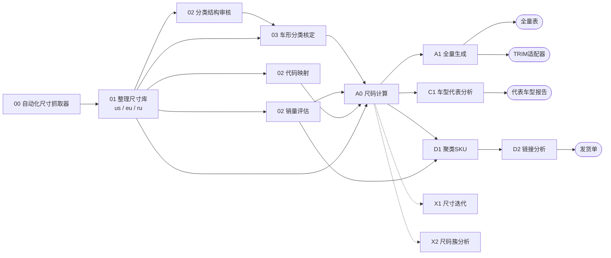

# 车型数据 Agent 流水线

本仓库把每个业务子项目视为独立 agent。节点、层号、产线与交付物登记在 [`pipeline.json`](pipeline.json)，通用执行规则见 [`AGENTS.md`](AGENTS.md)，当前发布状态见 [`release.json`](release.json)，依赖分析见 [`reports/流水线上下游关系报告.md`](reports/流水线上下游关系报告.md)。

## 命名：上游数字层号，下游按最终产物分线

- **00–03 上游**：目录前缀 `NN.` = 层号（最长上游链长度），同层互不依赖。
- **A0 尺码计算**：各产线共用的枢纽。从它开始按最终产物分线，线内序号自 1 递增：

| 产线 | 最终产物 | 节点 |
| --- | --- | --- |
| A 全量表 + TRIM 适配器 | 全量表 US/EU/RU/汇总、TRIM适配器 | A0.尺码计算 → A1.全量生成 |
| C 代表车型 | 代表车型报告 | C1.车型代表分析 |
| D 发货单 | 发货单 | D1.聚类SKU → D2.链接分析 |
| X 旁路 | 不进入最终产物 | X1.尺寸迭代、X2.尺码簇分析 |



## 交付物命名与发布

稳定交付物用中文语义名（`车型结构`、`车形分类`、`原子销量`、`尺寸库_US`、`全量表_US`、`TRIM适配器`、`代表车型报告`…）。

- **artifacts 内**：带批次版本后缀，`车型结构-20260921_01.csv`（`YYYYMMDD_NN` 与批次目录 `YYYY-MM-DD_NN_*` 一致）。
- **发布到 `output/`**：去掉后缀，文件名稳定（`车型结构.csv`），并写 `output/manifest.json`：交付物、sha256、行数、来源 artifact、上游节点及其版本、pending 项。
- 根目录 `release.json` 汇总每个节点当前版本与 artifact。

```powershell
python scripts/publish_release.py            # 自上游到下游全量发布
python scripts/publish_release.py --dry-run
python scripts/validate_pipeline_structure.py
```

`pipeline.json` 的 `outputs` 只列已存在的稳定交付物，尚未产出的放 `pending`（当前：区域抓取候选、原子销量、全量表_EU、全量表_汇总、SKU聚类结果、发货单、尺寸迭代候选）。

## DIMENSION-CODE

`02.代码映射` 读取 `01.整理尺寸库/output/尺寸库.csv`，按区域独立编码，输出 `尺寸编码映射.csv`（`DIMENSION-ID` → `DIMENSION-CODE`）。全量表带 `DIMENSION-CODE` 列（在 `DIMENSION-ID` 之前）。

`DIMENSION-CODE = 区域前缀 + MAKECODE + MODELCODE + YEARCODE`

| 区域 | 前缀 | MAKE / MODEL 码宽 | 示例 |
| --- | --- | --- | --- |
| US | 无 | 2 位 | `25029501` |
| EU | `E` | 3 位 | `E0160130912` |
| RU | `R` | 3 位 | `R0000002626` |

`YEARCODE` 为年份区间两端后两位拼接：`1956-2012 → 5612`，单年 `1994 → 9494`。同车型同年份的不同结构会共码，`DIMENSION-ID` 才是唯一主键。

## 三层数据边界

| 目录 | 含义 | 是否供下游读取 |
| --- | --- | --- |
| `data/` | agent 自己维护的规则、映射、例外和参考资料 | 仅本 agent |
| `output/` | 当前已校验的稳定交付物 + manifest.json | 是，唯一正式接口 |
| `artifacts/` | 每次运行的输入、规则、带版本后缀的输出、报告快照 | 否，仅审计与回溯 |

对外发布目录为 `\\NAS8824B4\Public\PQData\pub_all_cars_data`，不纳入 Git，也不是 agent 间的数据源。仅发布 CSV 数据表；JSON 等辅助小文件保留在节点 `output/` 和 `artifacts/`，发布内容和来源由该目录的 `README.md` 说明。根目录 `pipeline.json` 由流水线最后节点 `D2.链接分析` 维护。
