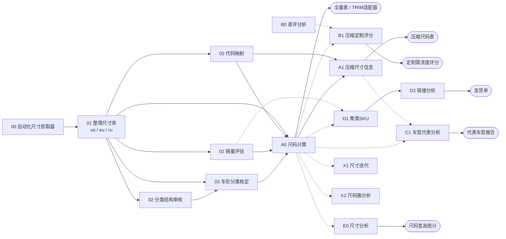

# 车型数据 Agent 流水线

本仓库把每个业务子项目视为独立 agent。节点、层号、产线与交付物登记在 [`pipeline.json`](pipeline.json)，通用执行规则见 [`AGENTS.md`](AGENTS.md)，当前发布状态见 [`release.json`](release.json)，依赖分析见 [`reports/流水线上下游关系报告.md`](reports/流水线上下游关系报告.md)。

## 命名：上游数字层号，下游按最终产物分线

- **00–03 上游**：目录前缀 `NN.` = 层号（最长上游链长度），同层互不依赖。
- **A0 尺码计算**：各产线共用的枢纽。从它开始按最终产物分线，线内序号自 1 递增：

| 产线 | 触发 | 最终产物 | 节点 |
| --- | --- | --- | --- |
| A 全量表 + 压缩尺码表 | 自动 | 全量表 US（含 TRIM）/EU/RU、店铺全量表、TRIM适配器、尺码匹配报告（A0）；压缩尺码表（A1） | A0.尺码计算 → A1.压缩尺寸信息 |
| B 定制评分 | 按需 | 差评分析表、定制需求度评分 | B0.差评分析 → B1.压缩定制评分 |
| C 代表车型 | 按需 | 代表车型报告 | C1.车型代表分析 |
| D 发货单 | 按需 | 发货单 | D1.聚类SKU → D2.链接分析 |
| E 尺寸分析 | 按需 | 尺码宽高统计、极值车型、尺寸异常 | E0.尺寸分析 |
| X 旁路 | 按需 | 不进入最终产物 | X1.尺寸迭代、X2.尺码簇分析 |

**触发方式**（`pipeline.json` 的 `line_triggers`）：上游 00–03 与 A 线为自动，默认发布自上游到下游刷新；B/C/D/E/X 为按需分析，上游更新不会触发它们，只在状态中标为“按需待刷新”，需要时再运行该节点并点名发布。自动节点不得依赖按需节点。


```mermaid
flowchart LR
  n00["00 自动化尺寸抓取器"] --> n01["01 整理尺寸库<br/>us / eu / ru"]
  n01 --> n02a["02 分类结构审核"]
  n01 --> n02b["02 销量评估"]
  n01 --> n02c["02 代码映射"]
  n02a --> n03["03 车形分类核定"]
  n01 --> n03
  n03 --> A0["A0 尺码计算"]
  n02b --> A0
  n02c --> A0
  n01 --> A0
  A0 --> fa(["全量表 / TRIM适配器"])
  A0 --> A1["A1 压缩尺寸信息"] --> fz(["压缩尺码表"])
  n02c --> A1
  A0 -.-> B1["B1 压缩定制评分"] --> fs(["定制需求度评分"])
  B0["B0 差评分析"] -.-> B1
  A0 -.-> C1["C1 车型代表分析"] --> fc(["代表车型报告"])
  A1 -.-> C1
  A0 -.-> D1["D1 聚类SKU"] --> D2["D2 链接分析"] --> fd(["发货单"])
  n02b -.-> D1
  A0 -.-> E0["E0 尺寸分析"] --> fe(["尺码宽高统计"])
  A0 -.-> X1["X1 尺寸迭代"]
  A0 -.-> X2["X2 尺码簇分析"]
```

## 交付物命名与发布

稳定交付物用中文语义名（`车型结构`、`车形分类`、`原子销量`、`尺寸库_US`、`全量表_US`、`TRIM适配器`、`代表车型报告`…）。

- **artifacts 内**：带批次版本后缀，`车型结构-20260921_01.csv`（`YYYYMMDD_NN` 与批次目录 `YYYY-MM-DD_NN_*` 一致）。每份字节只存一次：未变化的交付物引用旧批次文件，上游输入与已提交规则只记引用（见 `lib/artifact_batch.py`），内容未变化的节点发布时不新建批次。
- **发布到 `output/`**：去掉后缀，文件名稳定（`车型结构.csv`），并写 `output/manifest.json`：交付物、sha256、行数、来源 artifact、上游节点及其版本、pending 项。
- 根目录 `release.json` 汇总每个节点当前版本与 artifact。

```powershell
python scripts/publish_release.py            # 自上游到下游发布全部自动节点（U、A 线；同时刷新 流水线状态.md）
python scripts/publish_release.py --nodes representative-model   # 按需节点：运行节点 run 后点名发布
python scripts/publish_release.py --lines B,C # 按线发布按需节点；--all 包括全部按需节点
python scripts/publish_release.py --dry-run
python scripts/publish_release.py --status-only  # 不发布，只按当前 manifest 重建 流水线状态.md
python scripts/validate_pipeline_structure.py
python scripts/verify_pipeline.py            # 打通验证：依赖、编译、测试
python scripts/verify_pipeline.py --rebuild all  # 沙箱重跑节点并比对 output
```

当前流水线状态见 [`流水线状态.md`](流水线状态.md)：节点版本、触发方式、是否过期/按需待刷新、待产出项与交付物来源。该文件只由发布脚本生成，请勿手工修改。

## 代码布局

| 位置 | 内容 |
| --- | --- |
| `<节点>/<code_dir>/` | 节点代码，`code_dir` 为 `src`、`code` 或 `scripts`，登记在 `pipeline.json`；节点根目录不放 `.py` 脚本 |
| `<节点>/tests/` | 节点测试（`pipeline.json` 的 `tests`） |
| `lib/` | 跨节点共享模块：`id_scheme.py`、`full_table_schema.py`、`regional_size_common.py` |
| `scripts/` | 仓库级工具：发布、追踪、结构校验、打通验证 |
| `tests/` | 仓库级测试 |

每个节点的正式生成命令登记在 `pipeline.json` 的 `run`，在节点目录下执行，例如 `A1.压缩尺寸信息` 为 `python src/run.py`。

`pipeline.json` 的 `outputs` 只列已存在的稳定交付物，尚未产出的放 `pending`（当前：区域抓取候选、原子销量、全量表_EU、全量表_汇总、SKU聚类结果、发货单、尺寸迭代候选）。

## DIMENSION-CODE

`02.代码映射` 读取 `01.整理尺寸库/output/尺寸库.csv`，按区域独立编码，输出 `尺寸编码映射.csv`（`DIMENSION-ID` → `DIMENSION-CODE`）。全量表带 `DIMENSION-CODE` 列（在 `DIMENSION-ID` 之前）。

`DIMENSION-CODE = 区域前缀 + MAKECODE + MODELCODE + YEARCODE`

| 区域 | 前缀 | MAKE / MODEL 码宽 | 示例 |
| --- | --- | --- | --- |
| US | 无 | 2 位 | `25029501` |
| EU | `E` | 3 位 | `E0160130912` |
| RU | `R` | 3 位 | `R0000002626` |

`YEARCODE` 为年份区间两端后两位拼接：`1956-2012 → 5612`，单年 `1994 → 9494`。同车型同年份的不同结构会共码，`DIMENSION-ID` 才是唯一主键。

## 三层数据边界

| 目录 | 含义 | 是否供下游读取 |
| --- | --- | --- |
| `data/` | agent 自己维护的规则、映射、例外和参考资料 | 仅本 agent |
| `output/` | 当前已校验的稳定交付物 + manifest.json | 是，唯一正式接口 |
| `artifacts/` | 每次运行的输入引用、规则快照（sha256 + git commit）、带版本后缀的输出、gzip 中间表、报告 | 否，仅审计与回溯 |

对外发布目录为 `\\NAS8824B4\Public\PQData\pub_all_cars_data`，不纳入 Git，也不是 agent 间的数据源。仅发布 CSV 数据表；JSON 等辅助小文件保留在节点 `output/` 和 `artifacts/`，发布内容和来源由该目录的 `README.md` 说明。根目录 `pipeline.json` 由流水线最后节点 `D2.链接分析` 维护。
